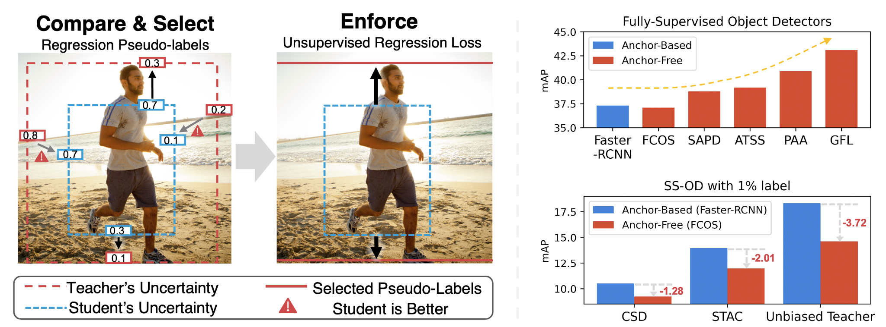

# Unbiased Teacher v2: Semi-supervised Object Detection for Anchor-free and Anchor-based Detectors

 [](https://opensource.org/licenses/MIT)

This is the PyTorch implementation of our paper: <br>
**Unbiased Teacher v2: Semi-supervised Object Detection for Anchor-free and Anchor-based Detectors**<br>
[Yen-Cheng Liu](https://ycliu93.github.io/), [Chih-Yao Ma](https://chihyaoma.github.io/), [Zsolt Kira](https://www.cc.gatech.edu/~zk15/)<br>
The IEEE / CVF Computer Vision and Pattern Recognition Conference (CVPR), 2022 <br>

[[Paper](https://openaccess.thecvf.com/content/CVPR2022/papers/Liu_Unbiased_Teacher_v2_Semi-Supervised_Object_Detection_for_Anchor-Free_and_Anchor-Based_CVPR_2022_paper.pdf)] [[Project](https://ycliu93.github.io/projects/unbiasedteacher2.html)]

<p align="center">

</p>

# What's new in Unbiased Teacher v2

- Higher Accuracy: Achieve higher mAP compared to Unbiased Teacher v1
- Generalization: SSOD method for both Faster-RCNN and FCOS

# Installation

## Prerequisites

- Linux or macOS with Python ≥ 3.7
- PyTorch ≥ 1.10 and torchvision that matches the PyTorch installation.
- Detectron2 ≥ 0.6 (other versions are not verified)

## Install PyTorch in Conda env

```shell
# create conda env
conda create -n ut2 python=3.7
# activate the enviorment
conda activate ut2
# install PyTorch >=1.5 with GPU
conda install pytorch torchvision -c pytorch
```

## Install Detectron2

Follow the [INSTALL.md](https://github.com/facebookresearch/detectron2/blob/master/INSTALL.md) to install Detectron2.

Also check Detectron2 v0.6 in this [link](https://github.com/facebookresearch/detectron2/releases/tag/v0.6).

## Dataset download

1. Download COCO dataset

```shell
# download images
wget http://images.cocodataset.org/zips/train2017.zip
wget http://images.cocodataset.org/zips/val2017.zip

# download annotations
wget http://images.cocodataset.org/annotations/annotations_trainval2017.zip
```

2. Organize the dataset as following:

```shell
unbiased_teacher_v2/
└── datasets/
    └── coco/
        ├── train2017/
        ├── val2017/
        └── annotations/
            ├── instances_train2017.json
            └── instances_val2017.json
```

## Training

### Faster-RCNN

- Train Unbiased Teacher v2 under 1% COCO-supervision

```shell
python train_net.py \
      --num-gpus 8 \
      --config configs/Faster-RCNN/coco-standard/faster_rcnn_R_50_FPN_ut2_sup1_run0.yaml \
       SOLVER.IMG_PER_BATCH_LABEL 16 SOLVER.IMG_PER_BATCH_UNLABEL 16
```

- Train Unbiased Teacher v2 under 2% COCO-supervision

```shell
python train_net.py \
      --num-gpus 8 \
      --config configs/Faster-RCNN/coco-standard/faster_rcnn_R_50_FPN_ut2_sup2_run0.yaml \
       SOLVER.IMG_PER_BATCH_LABEL 16 SOLVER.IMG_PER_BATCH_UNLABEL 16
```

- Train Unbiased Teacher v2 under 5% COCO-supervision

```shell
python train_net.py \
      --num-gpus 8 \
      --config configs/Faster-RCNN/coco-standard/faster_rcnn_R_50_FPN_ut2_sup5_run0.yaml \
       SOLVER.IMG_PER_BATCH_LABEL 16 SOLVER.IMG_PER_BATCH_UNLABEL 16
```

- Train Unbiased Teacher v2 under 10% COCO-supervision

```shell
python train_net.py \
      --num-gpus 8 \
      --config configs/Faster-RCNN/coco-standard/faster_rcnn_R_50_FPN_ut2_sup10_run0.yaml \
       SOLVER.IMG_PER_BATCH_LABEL 16 SOLVER.IMG_PER_BATCH_UNLABEL 16
```

### FCOS

- Train Unbiased Teacher v2 under 1% COCO-supervision

```shell
python train_net.py \
      --num-gpus 4 \
      --config configs/FCOS/coco-standard/fcos_R_50_ut2_sup1_run0.yaml \
       SOLVER.IMG_PER_BATCH_LABEL 8 SOLVER.IMG_PER_BATCH_UNLABEL 8
```

- Train Unbiased Teacher v2 under 2% COCO-supervision

```shell
python train_net.py \
      --num-gpus 4 \
      --config configs/FCOS/coco-standard/fcos_R_50_ut2_sup2_run0.yaml \
       SOLVER.IMG_PER_BATCH_LABEL 8 SOLVER.IMG_PER_BATCH_UNLABEL 8
```

- Train Unbiased Teacher v2 under 5% COCO-supervision

```shell
python train_net.py \
      --num-gpus 4 \
      --config configs/FCOS/coco-standard/fcos_R_50_ut2_sup5_run0.yaml \
       SOLVER.IMG_PER_BATCH_LABEL 8 SOLVER.IMG_PER_BATCH_UNLABEL 8
```

- Train Unbiased Teacher v2 under 10% COCO-supervision

```shell
python train_net.py \
      --num-gpus 4 \
      --config configs/FCOS/coco-standard/fcos_R_50_ut2_sup10_run0.yaml \
       SOLVER.IMG_PER_BATCH_LABEL 8 SOLVER.IMG_PER_BATCH_UNLABEL 8
```

## Resume the training

```shell
python train_net.py \
      --resume \
      --num-gpus 8 \
      --config configs/FCOS/coco-standard/fcos_R_50_ut2_sup10_run0.yaml \
       SOLVER.IMG_PER_BATCH_LABEL 8 SOLVER.IMG_PER_BATCH_UNLABEL 8 MODEL.WEIGHTS <your weight>.pth
```

## Evaluation

```shell
python train_net.py \
      --eval-only \
      --num-gpus 8 \
      --config configs/FCOS/coco-standard/fcos_R_50_ut2_sup10_run0.yaml \
       SOLVER.IMG_PER_BATCH_LABEL 8 SOLVER.IMG_PER_BATCH_UNLABEL 8 MODEL.WEIGHTS <your weight>.pth
```

## Model Zoo

Coming soon

## FAQ

1. How to use customized dataset ?

- A: please check the Detectron 2's [tutorial on customized dataset](https://detectron2.readthedocs.io/en/latest/tutorials/datasets.html) and also the [discussion thread in Unbiased Teacher v1](https://github.com/facebookresearch/unbiased-teacher/issues/10).

2. Q: What is `COCO_supervision.txt`? Could I remove it if I need to use my own dataset?

- A: `COCO_supervision.txt` stores data split of the results we presented in the paper. We did this to make sure the results are reproducible. Also, we found out that the variance across runs is less than 1 mAP, so using other random seed will lead to similar results.

## Citing Unbiased Teacher v2

If you use Unbiased Teacher v2 in your research or wish to refer to the results published in the paper, please use the following BibTeX entry.

```BibTeX
@InProceedings{Liu_2022_CVPR,
    author    = {Liu, Yen-Cheng and Ma, Chih-Yao and Kira, Zsolt},
    title     = {Unbiased Teacher v2: Semi-Supervised Object Detection for Anchor-Free and Anchor-Based Detectors},
    booktitle = {Proceedings of the IEEE/CVF Conference on Computer Vision and Pattern Recognition (CVPR)},
    month     = {June},
    year      = {2022},
    pages     = {9819-9828}
}
```

For Unbiased Teacher, please use the following BibTeX entry.

```BibTeX
@inproceedings{liu2021unbiased,
    title={Unbiased Teacher for Semi-Supervised Object Detection},
    author={Liu, Yen-Cheng and Ma, Chih-Yao and He, Zijian and Kuo, Chia-Wen and Chen, Kan and Zhang, Peizhao and Wu, Bichen and Kira, Zsolt and Vajda, Peter},
    booktitle={Proceedings of the International Conference on Learning Representations (ICLR)},
    year={2021},
}
```

Also, if you use Detectron2 in your research, please use the following BibTeX entry.

```BibTeX
@misc{wu2019detectron2,
  author =       {Yuxin Wu and Alexander Kirillov and Francisco Massa and
                  Wan-Yen Lo and Ross Girshick},
  title =        {Detectron2},
  howpublished = {\url{https://github.com/facebookresearch/detectron2}},
  year =         {2019}
}
```

The implemenation of FCOS in this repo is based on [AdelaiDet](https://github.com/aim-uofa/AdelaiDet), and please use the following BibTeX entry if you use the FCOS implementation in this repo.

```BibTeX
@misc{tian2019adelaidet,
  author =       {Tian, Zhi and Chen, Hao and Wang, Xinlong and Liu, Yuliang and Shen, Chunhua},
  title =        {{AdelaiDet}: A Toolbox for Instance-level Recognition Tasks},
  howpublished = {\url{https://git.io/adelaidet}},
  year =         {2019}
}
```

## License

This project is licensed under [MIT License](LICENSE), as found in the LICENSE file.
